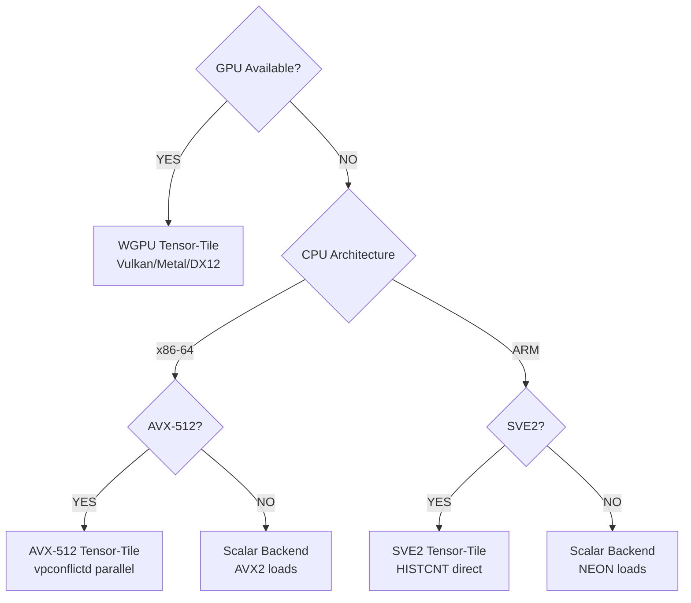

# TreeBoost

> **High-performance GBDT for Rust. GPU-accelerated by default. Production-ready.**

TreeBoost is a gradient boosted decision tree engine in pure Rust with automatic multi-backend hardware acceleration. Supports WGPU (all GPUs: NVIDIA, AMD, Intel, Apple), AVX-512, SVE2, with optimized scalar fallback. Works out of the box with zero configuration.

## Why TreeBoost?

**Other Rust GBDT libraries are basic.** TreeBoost gives you the performance and features you'd expect from LightGBM or XGBoost—but built for Rust developers, fully typed, and production-ready.

**Why Rust GBDT?**

- Zero-copy, type-safe data handling
- Deploy without runtime overhead
- Memory safety guarantees
- Excellent for systems where Python isn't an option

**What You Get:**

- **5-5.5× faster on GPU** than scalar CPU for large datasets (100K+ rows)
- **Zero configuration** — automatic backend selection (GPU → AVX-512 → scalar fallback)
- **Advanced features** — entropy regularization, conformal intervals, target encoding
- **Production features** — model checkpointing, inference optimization, feature importance

## Quick Start

### Rust (Native)

```rust
use treeboost::{GBDTConfig, GBDTModel};
use treeboost::dataset::DatasetLoader;

let loader = DatasetLoader::new(255);
let dataset = loader.load_parquet("data.parquet", "target", None)?;

let config = GBDTConfig::new()
    .with_num_rounds(100)
    .with_max_depth(6)
    .with_learning_rate(0.1);

let model = GBDTModel::train_binned(&dataset, config)?;
treeboost::serialize::save_model(&model, "model.rkyv")?;

let predictions = model.predict(&dataset)?;
```

### Python (via PyO3)

```python
import numpy as np
from treeboost import GBDTConfig, GBDTModel

X = np.random.randn(10000, 20).astype(np.float32)
y = (X[:, 0] + X[:, 1] * 2 + np.random.randn(10000) * 0.1).astype(np.float32)

config = GBDTConfig()
config.num_rounds = 100
config.max_depth = 6
config.learning_rate = 0.1

model = GBDTModel.train(X, y, config)
predictions = model.predict(X)
model.save("model.rkyv")
```

## How It Works: Automatic Backend Selection



**WebGPU backend:** Works on all GPUs (NVIDIA, AMD, Intel, Apple) via Vulkan, Metal, or DX12. Designed for portability - no installation required beyond your system drivers. Uses Hybrid mode (GPU histogram + CPU tree growth) due to WebGPU's higher dispatch overhead.

**CUDA backend:** Enables Full GPU mode with custom kernels - **2x+ faster than WebGPU** on NVIDIA hardware. Low dispatch latency allows the entire tree building pipeline to run on GPU (histogram, partition, level-wise growth). The speedup grows with larger datasets. Optional but recommended for NVIDIA users.

**Coming soon:** Native Metal and ROCm backends for Apple and AMD GPUs.

**CPU backends:** AVX-512 (3rd Gen Xeon+), SVE2 (ARM Neoverse), with optimized scalar fallback.

### Explicit Backend Selection

By default, TreeBoost auto-detects the best backend. Specify backends explicitly to override:

**Rust:**

```rust
use treeboost::{GBDTConfig, GBDTModel};
use treeboost::backend::BackendType;

let config = GBDTConfig::new()
    .with_num_rounds(100)
    .with_max_depth(6)
    .with_backend(BackendType::Scalar);  // Force CPU (AVX2/NEON)

let model = GBDTModel::train(&features, num_features, &targets, config, None)?;
```

**Available backends:**

```rust
BackendType::Scalar   // CPU: AVX2 (x86) or NEON (ARM) - no GPU overhead
BackendType::Avx512  // CPU: AVX-512 tensor-tile (x86-64 only)
BackendType::Sve2    // CPU: SVE2 tensor-tile (ARM only)
BackendType::Wgpu    // GPU: All GPUs via Vulkan/Metal/DX12 (portable)
BackendType::Cuda    // GPU: NVIDIA CUDA (2x+ faster than WGPU)
BackendType::Auto    // (Default) Auto-detect: CUDA > WGPU > AVX-512 > SVE2 > Scalar
```

**Python:**

```python
from treeboost import GBDTConfig, GBDTModel

config = GBDTConfig()
config.num_rounds = 100
config.max_depth = 6
config.backend = "scalar"  # Force CPU

model = GBDTModel.train(X, y, config)
```

### Performance

### Competitive Benchmarks

**Inference:** Optimized for CPU execution via Rayon parallelism. Fast inference on standard compute eliminates GPU deployment overhead—no need for expensive GPU VMs just to serve predictions.

**Training:** Automatic backend selection balances speed and cost. CPU training is already fast for datasets <100K rows; GPU acceleration (CUDA/WGPU) provides significant speedup for larger datasets (100K–1B+ rows) where the computational advantage justifies GPU deployment.

Compared to other pure-Rust GBDT implementations:

**Inference (per-batch prediction):**

| Dataset     | TreeBoost | gbdt-rs  | forust  | Speedup              |
| ----------- | --------- | -------- | ------- | -------------------- |
| 100 samples | 47.4 µs   | 135.5 µs | 92.9 µs | **2.9x vs gbdt-rs**  |
| 1K samples  | 202 µs    | 1.29 ms  | 893 µs  | **6.4x vs gbdt-rs**  |
| 10K samples | 539 µs    | 11.7 ms  | 8.9 ms  | **21.7x vs gbdt-rs** |

**Training:**

| Dataset                          | TreeBoost | gbdt-rs  | forust   | Speedup              |
| -------------------------------- | --------- | -------- | -------- | -------------------- |
| 100K rows, 50 rounds             | 263 ms    | 3,389 ms | 581 ms   | **12.9x vs gbdt-rs** |
| 100K rows, 100 rounds (parallel) | 344 ms    | 6,600 ms | 2,020 ms | **19.2x vs gbdt-rs** |

_Benchmarks: NVIDIA CUDA (Full GPU mode), raw float32 data, per-iteration time. See `benches/competitors.rs` for reproducible methodology._

**Running Benchmarks:**

```bash
# CPU-only comparison (fast, ~2 minutes)
cargo bench --bench competitors

# GPU-enabled comparison (with CUDA acceleration)
cargo bench --bench competitors --features gpu,cuda

# Python cross-library comparison
python benchmarks/benchmark.py --mode cross-library-gpu
```

## Core Features

### Robustness

- **Shannon Entropy regularization** — Prevent drift across time windows
- **Pseudo-Huber loss** — Automatic outlier handling (smoother than MSE)
- **Split Conformal Prediction** — Distribution-free uncertainty intervals on predictions

### Data Handling

- **Ordered Target Encoding** — High-cardinality categoricals without target leakage
- **Count-Min Sketch** — Automatic rare category compression (memory efficient)

### Model Control

- **Monotonic/Interaction constraints** — Enforce domain knowledge
- **Feature importance** — Understand model decisions

### Production

- **Zero-copy serialization** — 100MB+ models load in milliseconds via rkyv
- **Streaming inference** — Predict on 1M rows in seconds

## Installation

### Rust Library

```bash
cargo add treeboost
```

### Python Package

```bash
# From PyPI
pip install treeboost

# From source (requires Rust toolchain)
git clone https://github.com/your-org/treeboost
cd treeboost
pip install maturin && maturin develop --release
```

## More Examples

### Rust: Train and Save

```rust
use treeboost::{GBDTConfig, GBDTModel};
use treeboost::dataset::DatasetLoader;

// Load data
let loader = DatasetLoader::new(255);
let dataset = loader.load_parquet("train.parquet", "target", None)?;

// Configure and train
let config = GBDTConfig::new()
    .with_num_rounds(200)
    .with_max_depth(8)
    .with_learning_rate(0.05)
    .with_entropy_weight(0.1);  // Regularize for drift

let model = GBDTModel::train_binned(&dataset, config)?;
treeboost::serialize::save_model(&model, "model.rkyv")?;

// Load and predict
let predictions = model.predict(&dataset)?;
let importances = model.feature_importance();
```

### Python: Conformal Prediction

```python
from treeboost import GBDTConfig, GBDTModel

X = np.random.randn(10000, 50).astype(np.float32)
y = np.sum(X[:, :5], axis=1) + np.random.randn(10000) * 0.5

config = GBDTConfig()
config.num_rounds = 100
config.max_depth = 6
config.calibration_ratio = 0.2    # Reserve 20% for uncertainty estimation
config.conformal_quantile = 0.9   # 90% prediction intervals

model = GBDTModel.train(X, y, config)
preds, lower, upper = model.predict_with_intervals(X_test)

# Now you have uncertainty bounds on every prediction
print(f"Prediction: {preds[0]:.2f}, [{lower[0]:.2f}, {upper[0]:.2f}]")
```

### Python: Categorical Features

```python
import pandas as pd
from treeboost import GBDTConfig, GBDTModel

df = pd.read_csv("data.csv")

# Target encoding for high-cardinality categorical
config = GBDTConfig()
config.num_rounds = 100
config.use_target_encoding = True    # Ordered encoding, no leakage
config.cms_threshold = 100           # Rare categories → "Unknown"

X = df[feature_cols].values.astype(np.float32)
y = df['target'].values.astype(np.float32)

model = GBDTModel.train(X, y, config)
```

## CLI Tool

If you're using the binary distribution:

```bash
# Train a model
treeboost train --data data.csv --target price --output model.rkyv \
  --rounds 100 --max-depth 6 --learning-rate 0.1

# Make predictions
treeboost predict --model model.rkyv --data test.csv --output predictions.json

# Inspect the model
treeboost info --model model.rkyv --importances
```

Run `treeboost <command> --help` for all available options.

## Configuration Reference

### Core Hyperparameters

| Parameter       | Default | Description                                                   |
| --------------- | ------- | ------------------------------------------------------------- |
| `num_rounds`    | 100     | Number of boosting iterations                                 |
| `max_depth`     | 6       | Maximum tree depth (deeper = more expressive but slower)      |
| `learning_rate` | 0.1     | Shrinkage per round (lower = more stable but slower training) |
| `max_leaves`    | 31      | Maximum leaves per tree                                       |
| `lambda`        | 1.0     | L2 leaf regularization                                        |
| `loss`          | `mse`   | `mse` or `huber` (huber for outliers)                         |

### Advanced Features

| Parameter             | Default | Description                                            |
| --------------------- | ------- | ------------------------------------------------------ |
| `entropy_weight`      | 0.0     | Shannon entropy penalty (prevents drift)               |
| `subsample`           | 1.0     | Row sampling ratio per round                           |
| `colsample`           | 1.0     | Feature sampling ratio per tree                        |
| `calibration_ratio`   | 0.0     | Fraction of data reserved for conformal calibration    |
| `conformal_quantile`  | 0.9     | Quantile for prediction intervals (0.9 = 90% coverage) |
| `use_target_encoding` | false   | Enable ordered target encoding for categoricals        |
| `cms_threshold`       | 0       | Rare category threshold (0 = disabled)                 |

### Constraints

```python
config.monotonic_constraints = [
    MonotonicConstraint.Increasing,   # Feature 0
    MonotonicConstraint.None,         # Feature 1
    MonotonicConstraint.Decreasing,   # Feature 2
]

config.interaction_groups = [
    [0, 1, 2],  # These features can interact
    [3, 4],     # Separate interaction group
]
```

## Troubleshooting

**Check which backend is being used:**

```bash
RUST_LOG=treeboost=debug treeboost train ...
```

**GPU not detected:**

- Verify your GPU drivers are installed (NVIDIA, AMD, Intel, or Apple)
- WGPU supports Vulkan (Linux), Metal (macOS), DX12 (Windows)
- For NVIDIA CUDA: Install CUDA 12.x separately

**Out of memory during training:**

```bash
treeboost train ... --subsample 0.8 --colsample 0.8
```

**Model won't load:**

- Ensure you're using the same TreeBoost version for save/load
- The `.rkyv` file is tied to the binary layout; recompiling TreeBoost may break compatibility

## License

Apache License 2.0
