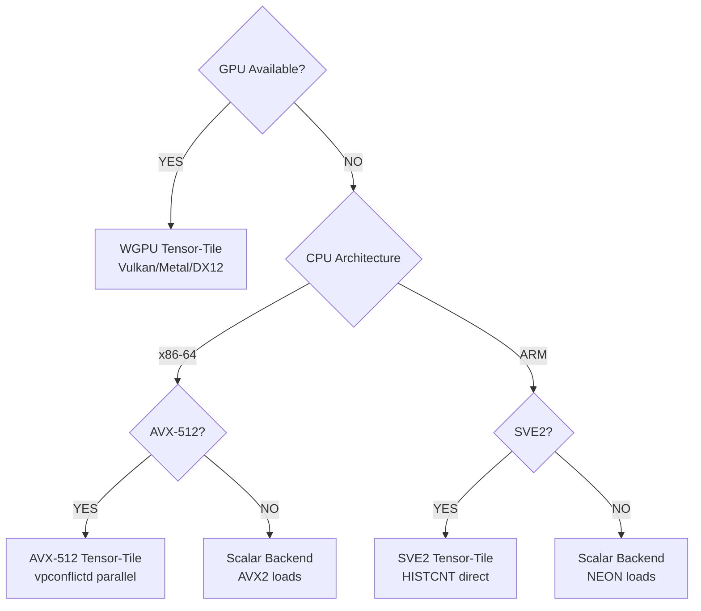

# TreeBoost


> **Universal Tabular Learning Engine. Linear models, GBDTs, and Random Forests—unified.**

TreeBoost combines the extrapolation power of linear models, the interaction-capturing ability of gradient boosted trees, and the robustness of random forests—all in a single, zero-copy, production-ready Rust binary. GPU-accelerated out of the box.

## Why TreeBoost?

Most tabular problems are solved by Linear, Tree, or their combination. Other libraries make you pick one. TreeBoost gives you all three through a single `UniversalModel` interface, plus automatic mode selection via the AutoTuner.

**The Architecture:**

```
┌─────────────────────────────────────────────────────────────┐
│                      UniversalModel                         │
├──────────────┬──────────────────────┬───────────────────────┤
│   PureTree   │   LinearThenTree     │    RandomForest       │
│   (GBDT)     │   (Hybrid)           │    (Bagging)          │
│              │                      │                       │
│ Best for:    │ Best for:            │ Best for:             │
│ - General    │ - Time-series        │ - Noisy data          │
│ - Categorics │ - Trending data      │ - Variance reduction  │
│              │ - Extrapolation      │ - Avoiding overfit    │
└──────────────┴──────────────────────┴───────────────────────┘
```

**Why Rust?**

- Zero-copy, type-safe data handling
- Deploy without Python runtime
- Memory safety guarantees
- Single binary, no dependencies

**What You Get:**

- **AutoML mode selection** — instant data analysis picks `PureTree`, `LinearThenTree`, or `RandomForest` without expensive training trials.
- **Hybrid Linear+Tree architecture** — `LinearThenTree` mode captures global trends with linear models, then trees learn the residuals. Extrapolates beyond training range.
- **Built-in preprocessing pipeline** — Scalers, encoders, imputers that serialize _with_ the model. No train/test skew.
- **Linear Trees** — Decision trees with Ridge regression in leaves. 10-100x fewer trees for piecewise linear data.
- **Automatic hyperparameter tuning** — AutoTuner with Latin Hypercube Sampling, k-fold CV, parallel evaluation. Tries all three modes automatically.
- **GPU acceleration** — WGPU (all GPUs), CUDA (NVIDIA), with AVX-512/SVE2/scalar fallback
- **Production features** — conformal prediction intervals, entropy regularization, ordered target encoding, zero-copy serialization

## Automatic Hyperparameter Optimization

TreeBoost includes a production-ready **AutoTuner** that finds optimal hyperparameters automatically, eliminating manual tuning:

See `examples/autotuner.rs` for comprehensive examples.

## AutoML Mode Selection

TreeBoost can **analyze your dataset and pick the best boosting mode** without a full training sweep.

```rust
use treeboost::{UniversalModel, MseLoss};

let model = UniversalModel::auto(&dataset, &MseLoss)?;
println!("Selected mode: {:?}", model.mode());
println!("Confidence: {:?}", model.selection_confidence());
```

This analysis uses fast linear/tree probes and produces a full report you can log or inspect.

**Optional: Ensembling for PureTree**

```rust
use treeboost::{AutoConfig, AutoModel, AutoEnsembleMethod, MultiSeedConfig};

let ensemble_config = AutoConfig::new()
    .with_ensemble_method(AutoEnsembleMethod::RidgeStacking)
    .with_seed(42);

let model = AutoModel::train_with_config(&df, "target", ensemble_config)?;
```

## Quick Start

### Rust (Native)

```rust
use treeboost::{UniversalConfig, UniversalModel, BoostingMode};
use treeboost::dataset::DatasetLoader;
use treeboost::loss::MseLoss;

let loader = DatasetLoader::new(255);
let dataset = loader.load_parquet("data.parquet", "target", None)?;

// Choose your mode based on your data
let config = UniversalConfig::new()
    .with_mode(BoostingMode::LinearThenTree)  // Hybrid: linear trend + tree residuals
    .with_num_rounds(100)
    .with_linear_rounds(10)
    .with_learning_rate(0.1);

let model = UniversalModel::train(&dataset, config, &MseLoss)?;
let predictions = model.predict(&dataset);
```

**Quick mode selection:**

| Your Data                                  | Use This Mode                  |
| ------------------------------------------ | ------------------------------ |
| General tabular, categoricals              | `BoostingMode::PureTree`       |
| Time-series, trending, needs extrapolation | `BoostingMode::LinearThenTree` |
| Noisy data, want robustness                | `BoostingMode::RandomForest`   |

### Python (via PyO3)

```python
import numpy as np
from treeboost import UniversalConfig, UniversalModel, BoostingMode

X = np.random.randn(10000, 20).astype(np.float32)
y = (X[:, 0] + X[:, 1] * 2 + np.random.randn(10000) * 0.1).astype(np.float32)

config = UniversalConfig()
config.mode = BoostingMode.LinearThenTree  # Hybrid mode
config.num_rounds = 100
config.linear_rounds = 10
config.learning_rate = 0.1

model = UniversalModel.train(X, y, config)
predictions = model.predict(X)
```

> **Architecture note:** `UniversalModel` wraps `GBDTModel` internally—`PureTree` mode delegates directly to it. You get GPU acceleration, conformal prediction, and all mature features through either API. `GBDTModel` is still available for direct use if you prefer.

## How It Works: Automatic Backend Selection



**WebGPU backend:** Works on all GPUs (NVIDIA, AMD, Intel, Apple) via Vulkan, Metal, or DX12. Designed for portability - no installation required beyond your system drivers. Uses Hybrid mode (GPU histogram + CPU tree growth) due to WebGPU's higher dispatch overhead.

**CUDA backend:** Enables Full GPU mode with custom kernels - **2x+ faster than WebGPU** on NVIDIA hardware. Low dispatch latency allows the entire tree building pipeline to run on GPU (histogram, partition, level-wise growth). The speedup grows with larger datasets. Optional but recommended for NVIDIA users.

**Coming soon:** Native Metal and ROCm backends for Apple and AMD GPUs.

**CPU backends:** AVX-512 (3rd Gen Xeon+), SVE2 (ARM Neoverse), with optimized scalar fallback.

### Explicit Backend Selection

By default, TreeBoost auto-detects the best backend. Specify backends explicitly to override:

**Rust:**

```rust
use treeboost::{GBDTConfig, GBDTModel};
use treeboost::backend::BackendType;

let config = GBDTConfig::new()
    .with_num_rounds(100)
    .with_max_depth(6)
    .with_backend(BackendType::Scalar);  // Force CPU (AVX2/NEON)

let model = GBDTModel::train(&features, num_features, &targets, config, None)?;
```

**Available backends:**

```rust
BackendType::Scalar   // CPU: AVX2 (x86) or NEON (ARM) - no GPU overhead
BackendType::Avx512  // CPU: AVX-512 tensor-tile (x86-64 only)
BackendType::Sve2    // CPU: SVE2 tensor-tile (ARM only)
BackendType::Wgpu    // GPU: All GPUs via Vulkan/Metal/DX12 (portable)
BackendType::Cuda    // GPU: NVIDIA CUDA (2x+ faster than WGPU)
BackendType::Auto    // (Default) Auto-detect: CUDA > WGPU > AVX-512 > SVE2 > Scalar
```

**Python:**

```python
from treeboost import GBDTConfig, GBDTModel

config = GBDTConfig()
config.num_rounds = 100
config.max_depth = 6
config.backend = "scalar"  # Force CPU

model = GBDTModel.train(X, y, config)
```

### Performance

### Competitive Benchmarks

**Inference:** Optimized for CPU execution via Rayon parallelism. Fast inference on standard compute eliminates GPU deployment overhead—no need for expensive GPU VMs just to serve predictions.

**Training:** Automatic backend selection balances speed and cost. CPU training is already fast for datasets <100K rows; GPU acceleration (CUDA/WGPU) provides significant speedup for larger datasets (100K–1B+ rows) where the computational advantage justifies GPU deployment.

Compared to other pure-Rust GBDT implementations:

**Inference (per-batch prediction):**

| Dataset     | TreeBoost | gbdt-rs  | forust  | Speedup              |
| ----------- | --------- | -------- | ------- | -------------------- |
| 100 samples | 47.4 µs   | 135.5 µs | 92.9 µs | **2.9x vs gbdt-rs**  |
| 1K samples  | 202 µs    | 1.29 ms  | 893 µs  | **6.4x vs gbdt-rs**  |
| 10K samples | 539 µs    | 11.7 ms  | 8.9 ms  | **21.7x vs gbdt-rs** |

**Training:**

| Dataset                          | TreeBoost | gbdt-rs  | forust   | Speedup              |
| -------------------------------- | --------- | -------- | -------- | -------------------- |
| 100K rows, 50 rounds             | 263 ms    | 3,389 ms | 581 ms   | **12.9x vs gbdt-rs** |
| 100K rows, 100 rounds (parallel) | 344 ms    | 6,600 ms | 2,020 ms | **19.2x vs gbdt-rs** |

_Benchmarks: NVIDIA CUDA (Full GPU mode), raw float32 data, per-iteration time. See `benches/competitors.rs` for reproducible methodology._

**Running Benchmarks:**

```bash
# CPU-only comparison (fast, ~2 minutes)
cargo bench --bench competitors

# GPU-enabled comparison (with CUDA acceleration)
cargo bench --bench competitors --features gpu,cuda

# Python cross-library comparison
python benchmarks/benchmark.py --mode cross-library-gpu
```

## Core Features

### Robustness

- **Shannon Entropy regularization** — Prevent drift across time windows
- **Pseudo-Huber loss** — Automatic outlier handling (smoother than MSE)
- **Split Conformal Prediction** — Distribution-free uncertainty intervals on predictions

### Data Handling

- **Ordered Target Encoding** — High-cardinality categoricals without target leakage
- **Count-Min Sketch** — Automatic rare category compression (memory efficient)

### Model Control

- **Monotonic/Interaction constraints** — Enforce domain knowledge
- **Feature importance** — Understand model decisions

### Production

- **Zero-copy serialization** — 100MB+ models load in milliseconds via rkyv
- **Streaming inference** — Predict on 1M rows in seconds

## The Hybrid Architecture

### How LinearThenTree Works

The `LinearThenTree` mode implements what's sometimes called "Residual Boosting" or "Linear-Forest":

```
Final Prediction = Linear(x) + Trees(x)
                   ↑              ↑
                   │              └── Captures non-linear patterns, interactions
                   └── Captures global trend (can extrapolate!)
```

1. **Phase 1**: Train a Ridge/LASSO/ElasticNet model on all features
2. **Phase 2**: Compute residuals: `r = y - linear_prediction`
3. **Phase 3**: Train GBDT on residuals (the stuff linear couldn't explain)

This is powerful for data with underlying trends (time-series, pricing, growth curves). Pure trees can't extrapolate—they're bounded by training data. The linear component can.

### LinearTreeBooster (Different Thing!)

Don't confuse `LinearThenTree` mode with `LinearTreeBooster`. They solve different problems:

|                  | LinearThenTree (Mode)                 | LinearTreeBooster (Learner)                   |
| ---------------- | ------------------------------------- | --------------------------------------------- |
| **Structure**    | 1 global linear + many standard trees | Trees with linear models _in each leaf_       |
| **Best for**     | Global trends + local non-linearities | Piecewise linear data (tax brackets, physics) |
| **Trees needed** | Normal (50-200)                       | Very few (5-20)                               |

Use `LinearTreeBooster` when your data looks like segments with different slopes—the tree finds the breakpoints, Ridge fits each segment.

### Preprocessing That Travels With Your Model

TreeBoost's preprocessing pipeline serializes with your model:

```rust
use treeboost::preprocessing::{PipelineBuilder, StandardScaler, SimpleImputer};

let pipeline = PipelineBuilder::new()
    .add_standard_scaler(&["price", "quantity"])
    .add_simple_imputer(&["category"], ImputeStrategy::Mode)
    .add_frequency_encoder(&["category"])
    .build();

// Fit on training data
pipeline.fit(&train_df)?;

// Transform both train and test identically
let train_transformed = pipeline.transform(&train_df)?;
let test_transformed = pipeline.transform(&test_df)?;

// Pipeline state saved with model - no train/test skew at inference
```

**For Trees**: Use `FrequencyEncoder` or `LabelEncoder`. OneHot creates sparse nightmares.

**For Linear models**: Use `StandardScaler` (essential!) and `OneHotEncoder` (linear needs binary indicators).

**For Hybrid (`LinearThenTree`)**: The linear component gets internally standardized. You can still preprocess for the tree component.

## Installation

### Rust Library

```bash
cargo add treeboost
```

### Python Package

```bash
# From PyPI
pip install treeboost

# From source (requires Rust toolchain)
git clone https://github.com/your-org/treeboost
cd treeboost
pip install maturin && maturin develop --release
```

## More Examples

### Rust: Train and Save

```rust
use treeboost::{GBDTConfig, GBDTModel};
use treeboost::dataset::DatasetLoader;

// Load data
let loader = DatasetLoader::new(255);
let dataset = loader.load_parquet("train.parquet", "target", None)?;

// Configure and train
let config = GBDTConfig::new()
    .with_num_rounds(200)
    .with_max_depth(8)
    .with_learning_rate(0.05)
    .with_entropy_weight(0.1);  // Regularize for drift

let model = GBDTModel::train_binned(&dataset, config)?;
treeboost::serialize::save_model(&model, "model.rkyv")?;

// Load and predict
let predictions = model.predict(&dataset);
let importances = model.feature_importance();
```

### Python: Conformal Prediction

```python
from treeboost import GBDTConfig, GBDTModel

X = np.random.randn(10000, 50).astype(np.float32)
y = np.sum(X[:, :5], axis=1) + np.random.randn(10000) * 0.5

config = GBDTConfig()
config.num_rounds = 100
config.max_depth = 6
config.calibration_ratio = 0.2    # Reserve 20% for uncertainty estimation
config.conformal_quantile = 0.9   # 90% prediction intervals

model = GBDTModel.train(X, y, config)
preds, lower, upper = model.predict_with_intervals(X_test)

# Now you have uncertainty bounds on every prediction
print(f"Prediction: {preds[0]:.2f}, [{lower[0]:.2f}, {upper[0]:.2f}]")
```

### Python: Categorical Features

```python
import pandas as pd
from treeboost import GBDTConfig, GBDTModel

df = pd.read_csv("data.csv")

# Target encoding for high-cardinality categorical
config = GBDTConfig()
config.num_rounds = 100
config.use_target_encoding = True    # Ordered encoding, no leakage
config.cms_threshold = 100           # Rare categories → "Unknown"

X = df[feature_cols].values.astype(np.float32)
y = df['target'].values.astype(np.float32)

model = GBDTModel.train(X, y, config)
```

### Automatic Hyperparameter Tuning

**Rust:**

```rust
use treeboost::{AutoTuner, TunerConfig, GridStrategy, EvalStrategy, ParameterSpace, SpacePreset};

let tuner_config = TunerConfig::new()
    .with_iterations(3)
    .with_grid_strategy(GridStrategy::LatinHypercube { n_samples: 50 })
    .with_eval_strategy(EvalStrategy::holdout(0.2).with_folds(5)) // 5-fold CV
    .with_verbose(true);

let mut tuner = AutoTuner::new(GBDTConfig::new())
    .with_config(tuner_config)
    .with_space(ParameterSpace::with_preset(SpacePreset::Regression))
    .with_callback(|trial, current, total| {
        println!("Trial {}/{}: val_loss={:.4}", current, total, trial.val_metric);
    });

let (best_config, history) = tuner.tune(&dataset)?;
println!("Best validation loss: {:.6}", history.best().unwrap().val_metric);

// Train final model with best configuration
let final_model = GBDTModel::train_binned(&dataset, best_config)?;
```

**Python:**

```python
from treeboost import AutoTuner, TunerConfig, GridStrategy, EvalStrategy, ParameterSpace

tuner = AutoTuner(GBDTConfig())
tuner_config = (
    TunerConfig.preset("thorough")
    .with_grid_strategy(GridStrategy.lhs(50))
    .with_eval_strategy(EvalStrategy.holdout(0.2).with_folds(5))
    .with_verbose(True)
)
tuner.config = tuner_config
tuner.space = ParameterSpace.preset("regression")

best_config, history = tuner.tune(X, y)
print(f"Best validation loss: {history.best().val_metric:.6f}")

# Train final model
model = GBDTModel.train(X, y, best_config)
```

## CLI Tool

If you're using the binary distribution:

```bash
# Train a model
treeboost train --data data.csv --target price --output model.rkyv \
  --rounds 100 --max-depth 6 --learning-rate 0.1

# Make predictions
treeboost predict --model model.rkyv --data test.csv --output predictions.json

# Inspect the model
treeboost info --model model.rkyv --importances
```

Run `treeboost <command> --help` for all available options.

## Configuration Reference

### Core Hyperparameters

| Parameter       | Default | Description                                                   |
| --------------- | ------- | ------------------------------------------------------------- |
| `num_rounds`    | 100     | Number of boosting iterations                                 |
| `max_depth`     | 6       | Maximum tree depth (deeper = more expressive but slower)      |
| `learning_rate` | 0.1     | Shrinkage per round (lower = more stable but slower training) |
| `max_leaves`    | 31      | Maximum leaves per tree                                       |
| `lambda`        | 1.0     | L2 leaf regularization                                        |
| `loss`          | `mse`   | `mse` or `huber` (huber for outliers)                         |

### Advanced Features

| Parameter             | Default | Description                                            |
| --------------------- | ------- | ------------------------------------------------------ |
| `entropy_weight`      | 0.0     | Shannon entropy penalty (prevents drift)               |
| `subsample`           | 1.0     | Row sampling ratio per round                           |
| `colsample`           | 1.0     | Feature sampling ratio per tree                        |
| `calibration_ratio`   | 0.0     | Fraction of data reserved for conformal calibration    |
| `conformal_quantile`  | 0.9     | Quantile for prediction intervals (0.9 = 90% coverage) |
| `use_target_encoding` | false   | Enable ordered target encoding for categoricals        |
| `cms_threshold`       | 0       | Rare category threshold (0 = disabled)                 |

### Constraints

```python
config.monotonic_constraints = [
    MonotonicConstraint.Increasing,   # Feature 0
    MonotonicConstraint.None,         # Feature 1
    MonotonicConstraint.Decreasing,   # Feature 2
]

config.interaction_groups = [
    [0, 1, 2],  # These features can interact
    [3, 4],     # Separate interaction group
]
```

## Troubleshooting

**Check which backend is being used:**

```bash
RUST_LOG=treeboost=debug treeboost train ...
```

**GPU not detected:**

- Verify your GPU drivers are installed (NVIDIA, AMD, Intel, or Apple)
- WGPU supports Vulkan (Linux), Metal (macOS), DX12 (Windows)
- For NVIDIA CUDA: Install CUDA 12.x separately

**Out of memory during training:**

```bash
treeboost train ... --subsample 0.8 --colsample 0.8
```

**Model won't load:**

- Ensure you're using the same TreeBoost version for save/load
- The `.rkyv` file is tied to the binary layout; recompiling TreeBoost may break compatibility

## Acknowledgments

TreeBoost builds on the collective knowledge of the GBDT community. We acknowledge the following projects that shaped our design and implementation:

- **[XGBoost](https://github.com/dmlc/xgboost)** — Industry-standard GBDT with GPU support; inspired our histogram-based approach and Full GPU mode architecture.
- **[LightGBM](https://github.com/Mottl/lightgbm)** — Leaf-wise growth strategy and histogram optimization techniques.
- **[CatBoost](https://github.com/catboost/catboost/)** — Ordered target encoding for categorical features and conformal prediction intervals.
- **[Forust](https://github.com/jinlow/forust)** — Pure-Rust GBDT implementation; motivated our focus on Rust-first performance.
- **[WarpGBM](https://github.com/jefferythewind/warpgbm/tree/main/warpgbm)** — GPU-accelerated histogram building patterns.

## License

Apache License 2.0
