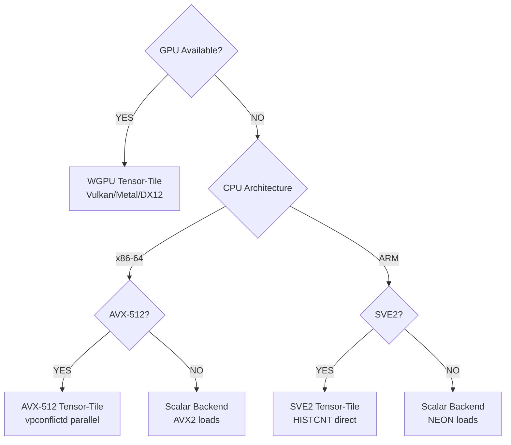

# TreeBoost

High-performance Gradient Boosted Decision Tree (GBDT) engine in pure Rust with automatic hardware acceleration.

## Architecture



| Dataset Size | Best Backend | Speedup vs Scalar |
|-------------|--------------|-------------------|
| < 10K rows | Scalar | 1.0x |
| 10K-100K | AVX-512/SVE2 | 1.5x |
| 100K-1M | GPU | 2-5x |
| > 1M rows | GPU | 10-50x |

## Features

- **Hardware acceleration**: WGPU (all GPUs), AVX-512, SVE2, with optimized scalar fallback
- **Shannon Entropy regularization**: Drift-resilient splits
- **Pseudo-Huber loss**: Outlier-robust regression
- **Split Conformal Prediction**: Distribution-free prediction intervals
- **Ordered Target Encoding**: High-cardinality categoricals without leakage
- **Count-Min Sketch**: Automatic rare category handling
- **Monotonic/Interaction constraints**: Domain knowledge enforcement
- **Zero-copy serialization**: Fast model loading via rkyv

## Installation

```bash
# Python
pip install treeboost

# Rust
cargo build --release

# Python from source
pip install maturin && maturin develop --release
```

## Quick Start

### Python

```python
import numpy as np
from treeboost import GBDTConfig, GBDTModel

X = np.random.randn(10000, 20).astype(np.float32)
y = (X[:, 0] + X[:, 1] * 2 + np.random.randn(10000) * 0.1).astype(np.float32)

config = GBDTConfig()
config.num_rounds = 100
config.max_depth = 6
config.learning_rate = 0.1

model = GBDTModel.train(X, y, config)
predictions = model.predict(X)

model.save("model.rkyv")
```

### Rust

```rust
use treeboost::{GBDTConfig, GBDTModel};
use treeboost::dataset::DatasetLoader;

let loader = DatasetLoader::new(255);
let dataset = loader.load_parquet("data.parquet", "target", None)?;

let config = GBDTConfig::new()
    .with_num_rounds(100)
    .with_max_depth(6)
    .with_learning_rate(0.1);

let model = GBDTModel::train_binned(&dataset, config)?;
treeboost::serialize::save_model(&model, "model.rkyv")?;
```

## CLI

```bash
# Train
treeboost train --data data.csv --target price --output model.rkyv \
  --rounds 100 --max-depth 6 --learning-rate 0.1

# Predict
treeboost predict --model model.rkyv --data test.csv --output predictions.json

# Inspect
treeboost info --model model.rkyv --importances
```

Run `treeboost <command> --help` for all options.

## Key Parameters

| Parameter | Default | Description |
|-----------|---------|-------------|
| `num_rounds` | 100 | Boosting iterations |
| `max_depth` | 6 | Maximum tree depth |
| `learning_rate` | 0.1 | Shrinkage rate |
| `max_leaves` | 31 | Maximum leaves per tree |
| `lambda` | 1.0 | L2 regularization |
| `entropy_weight` | 0.0 | Shannon entropy penalty |
| `subsample` | 1.0 | Row subsampling ratio |
| `colsample` | 1.0 | Column subsampling ratio |
| `loss` | mse | `mse` or `huber` |

## Advanced Usage

### Conformal Prediction

```python
config.calibration_ratio = 0.2   # Reserve 20% for calibration
config.conformal_quantile = 0.9  # 90% coverage
model = GBDTModel.train(X, y, config)
predictions, lower, upper = model.predict_with_intervals(X_test)
```

### Monotonic Constraints

```python
config.monotonic_constraints = [
    MonotonicConstraint.Increasing,   # Feature 0
    MonotonicConstraint.None,         # Feature 1
    MonotonicConstraint.Decreasing,   # Feature 2
]
```

### Interaction Constraints

```python
config.interaction_groups = [
    [0, 1, 2],  # Can interact within group
    [3, 4],     # Separate group
]
```

## Benchmarks

```bash
cargo bench --bench competitors
```

## Project Structure

```
src/
├── booster/      # GBDT model and training
├── backend/      # Hardware backends (WGPU, AVX-512, SVE2, Scalar)
├── dataset/      # Data loading and binning
├── tree/         # Tree structures and growth
├── histogram/    # Histogram construction
├── loss/         # Loss functions (MSE, Huber)
├── encoding/     # Categorical encoding (Target, CMS)
├── inference/    # Prediction and conformal intervals
└── serialize/    # Zero-copy serialization
```

## Troubleshooting

**Check backend selection:**
```bash
RUST_LOG=treeboost=debug treeboost train ...
```

**GPU not detected:** Verify drivers are installed. WGPU uses Vulkan/Metal/DX12.

**Out of memory:** Use `--subsample` and `--colsample` to reduce memory usage.

## License

Apache License 2.0
